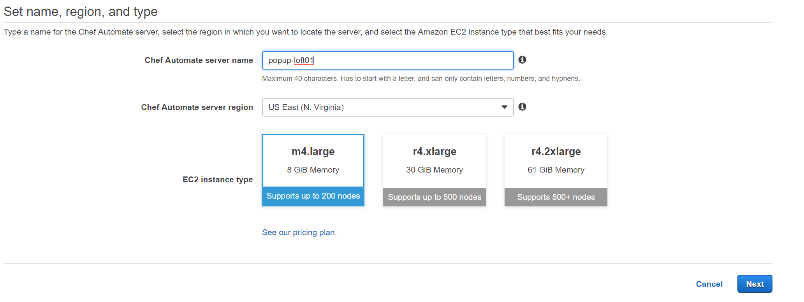
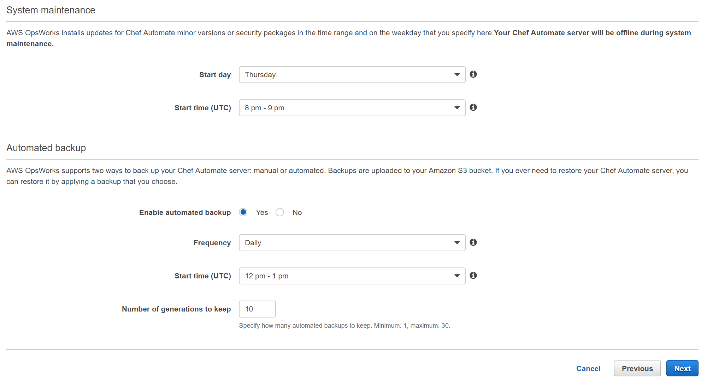

# Continuous Configuration Workshop - Berlin Pop-up Loft 2018

Here be workshops


### Prerequisites

### Create our VPC and our Nodes

Launch the `nodes-asg-cfn.yml` Cloudformation template in your account. This template will create the following:
- VPC
- Subnets
- Security Groups
- Internet Gateways
- Route Tables with its entries
- IAM Instance profiles
- Autoscaling Group
- Elastic Loadbalancer

You can do this, either with the Cloudformation web console or via the AWS CLI:
```
ws cloudformation create-stack --stack-name popuploft-opsworks-vpc-asg --template-body file://nodes-asg-cfn.yml --parameters ParameterKey=Key,ParameterValue=darko-us-east-1 --capabilities CAPABILITY_IAM --region us-east-1       
```

### Launching a Chef Automate Server
We need to launch a Opsworks for Chef Automate server via the console or via CLI. 

Here is an example how we do it via the CLI:
```bash
aws opsworks-cm ...
```

But we will do it via the Web console: 

Go to the AWS Web console and Search for `Opsworks`. Once on the Opsworks web console, select `Opsworks for Chef Automate` on the left hand menu. Click the big `+` button to add a new Chef Automate server.

Here we the Chef server name, region, and instance size. Pick a name, the `N. Virginia region` and just stick to the smallest instance size


This is where you set your SSH key in order to access your Chef server. This time we won't need it, so feel free to ignore this.


On the next page we can configure Network and Security, System Maintenance and Backup settings - If you are using the default VPC, just leave everything as default. 



Finally here is the review page, so we can review everything before creating. Make sure all looks good, and then click the `Launch` button.


Here is the Launching page - where you can see the creation progress of your Chef Automate server, and as well download the Web UI credentials and the **starter kit**. 

**MAKE SURE YOU DOWNLOAD THEM BOTH AS WE WILL NEED THEM LATER**


---

### Chef workstation
We will use AWS Cloud9 as our Workstation in order to communicate with the Chef Server. This is the simplest way we can have a workstation configured for managing our Chef Automate environment.

#### Create AWS Cloud9 Environment
- Log into the AWS Web Console (**as a NON root or federated user**) and search for Cloud 9. 
- Once on the Cloud9 Start page, click the `Create environment` button.
- Enter the name and description of your Environment - this can be anything. 
- When configuring settings we can keep everything as default - assuming you are creating it in the Default VPC. The important part is that your Cloud9 environment has access to the internet. 

- On the review page, review your settings and click the `Create` button.

It will take a few minutes for the environment to get created.

#### Configure the workstation

First off, what we need to install is the [Chef Development Kit](https://downloads.chef.io/chefdk). As our Cloud9 is running Amazon Linux under the hood we can use the RHEL 7 version of the ChefDK.
```bash
wget https://packages.chef.io/files/stable/chefdk/3.3.23/el/7/chefdk-3.3.23-1.el7.x86_64.rpm
sudo rpm -ivh chefdk-3.3.23-1.el7.x86_64.rpm
```
We should now have the `knife` command available if our ChefDK installed succesfully. 

### First steps on our Chef Automate server

#### Accessing our Chef Automate server for the first time

What we need now is the starter kit we hav acquired during the launch of our Opsworks for Chef Automate server. Unzip that starter kit somewhere on your Chef workstaiton. 
And lets see if we can communicate with our chef server:
```
cd starter_kit_directory
knife ssl fetch
```
If we get no errors - we should be able to start installing our first cookbook to the Chef server.

#### Installing the `chef-client` cookbook

One of the key cookbooks we will use is the [chef-client]() cookbook. This cookbook configures the chef-client service on the node and we can use the cookbooks attributes to configure the default behavior of the service.

The easiest way of installing this is via the use of `Berkshelf`. So, lets do so:
- Edit the `Berksfile` in your starter kit directory and make sure that there are only the following lines(remove the rest):
```
source "https://supermarket.chef.io"
cookbook "chef-client"
```
- Save the file and run `berks vendor cookbooks` from the root of your starter kit directory. The output should be something like this:
```
Resolving cookbook dependencies...
Fetching cookbook index from https://supermarket.chef.io...
Installing chef-client (11.0.1)
Installing cron (6.2.1)
Installing logrotate (2.2.0)
Vendoring chef-client (11.0.1) to cookbooks/chef-client
Vendoring cron (6.2.1) to cookbooks/cron
Vendoring logrotate (2.2.0) to cookbooks/logrotate
```
- Time to upload those cookbooks! Run `knife upload cookbooks`

If everything was succesfull we should be able to see the `chef-client` cookbook (and its dependencies) on our chef server by running the command `knife cookbook list`
```
chef-client   11.0.1
cron          6.2.1
logrotate     2.2.0
```

#### Lets create a role

Time to create a role that will be assigned to our nodes - and in which we can define the cookbooks and attributes to be used. 

To do this - lets create a role in the `roles` directory in our starter kit. Create a file named `popup-role.rb`, with the following contents:
```ruby
name "popup-role"
description "This is an example role"

run_list(
  "recipe[chef-client]"
)
default_attributes "chef_client" => { "interval" => "60", "splay"=> "10" }
```

After this it is time to create the role. We can do that by running the following command:

```
knife role from file roles/popup-role.rb
```

---

### Upload our starter kit to S3

In this step we will create an S3 bucket and store our starter kit `.zip` file (that we got during the Chef server launch) in it. This will be used later on with the CI/CD pipeline. 

#### Create a S3 bucket

You can do this via the Web Console or the AWS CLI 
```
aws s3 mb s3://<CHANGEME_BUCKET_NAME>
```

Upload the starter kit `.zip` file to this directory and make it public. Take note of the S3 path of this file, as we will need it later on. It should be something like: `s3://bucket-name/starterkit.zip`

---

### Bootstrapping nodes

So, we need to bootstrap our nodes! Let's first make some changes to our `userdata.sh` file which has come with out starter kit. In that file we need to change the runlist to contain the role we just created. 

To make this change, replace the following line:
```bash
RUN_LIST="role[opsworks-example-role]"
```
With:
```bash
RUN_LIST="role[popup-role]"
```

To bootstrap our node, lets modify the cloudformation template we used at the beginning - and add the contents of `userdata.sh` from the starter kit.

#### Modifying the `userdata` in our Autoscaling group

Lets add the modified `userdata.sh` to our Cloudformation template. Roughly on line 135 find the `LaunchConfig` resource. Here we will replace the `UserData` property from this: 
```yaml
...
  LaunchConfig:
    Type: 'AWS::AutoScaling::LaunchConfiguration'
    Properties:
      ...    
      UserData: 
        'Fn::Base64': !Sub |
          #!/bin/bash
          yum -y update
          yum -y install nginx
          service nginx start
...
```
To something like this (please note, most user data is ommited in this example):
```yaml
...
  LaunchConfig:
    Type: 'AWS::AutoScaling::LaunchConfiguration'
    Properties:
      ...    
      UserData: 
        'Fn::Base64': |
          #!/bin/bash

          # required settings
          NODE_NAME="$(curl --silent --show-error --retry 3 http://169.254.169.254/latest/meta-data/instance-id)" # this uses the EC2 instance ID as the node name
          CHEF_SERVER_NAME="my-opsworks" # The name of your Chef Server
          CHEF_SERVER_ENDPOINT="my-opsworks-wqtxjqwwrazsvrjp.eu-west-1.opsworks-cm.io" # The FQDN of your Chef Server
          REGION="eu-west-1" # Region of your Chef Server (Choose one of our supported regions - us-east-1, us-east-2, us-west-1, us-west-2, eu-central-1, eu-west-1, ap-northeast-1, ap-southeast-1, ap-southeast-2)
        
          # optional
          CHEF_ORGANIZATION="default"    # AWS OpsWorks for Chef Server always creates the organization "default"
          NODE_ENVIRONMENT=""            # E.g. development, staging, onebox ...
          CHEF_CLIENT_VERSION="13.8.5" # latest if empty
        
          # recommended: upload the chef-client cookbook from the chef supermarket  https://supermarket.chef.io/cookbooks/chef-client
          # Use this to apply sensible default settings for your chef-client config like logrotate and running as a service
          # you can add more cookbooks in the run list, based on your needs
          # Compliance runs require recipe[audit] to be added to the runlist.
        
          RUN_LIST="role[opsworks-example-role]" # Use tVhis role when following the starter kit example or specify recipes like recipe[chef-client],recipe[apache2] etc.
        
          # ---------------------------
          ...
...
```
Now, its time to update our CloudFormaton template from the web console with the latest template. 

#### Update Cloudformation stack

Once that is done - to ensure our nodes are running the latest userdata. You need to *terminate* the existing instance launched by the ASG. Once that is performed, the ASG will create a new instance with the new userdata. 
A few minutes after a new ASG instance has been launched, it should show up on our Chef Automate server under 'Nodes'. 

One more way we can check is with the `knife` command from our workstation.

Log into your Chef Workstation, and enter the root of your starterkit. To check the current node list, run the following command:
```bash
knife node list
```
Once the node is bootstrapped - it should show up there as a node (an instance ID should be shown *i-xxxxx*).

---

### Continuous Configuraton

Using AWS CodePipeline for Continuous Cookbook Integration

#### Summary:

This solution is an example of how you can continuously upload cookbooks to a Chef Server, provided that those cookbooks pass necessary tests. After committing changes to an AWS CodeCommit repository, a pipeline in AWS CodePipeline will be triggered. You will use two AWS CodeBuild stages. The first stage will test the cookbook in a variety of ways (such as general linting or syntax checks). You will also use Test Kitchen to run Bats tests to confirm that the cookbook passes application-specific tests before being uploaded to the Chef Server. The second CodeBuild stage will upload the cookbook to the Chef Server (provided all previous pipeline stages have successfully executed, and manual approval was granted).
After executing the steps outlined below, you will have a CodeCommit repository where you can commit new cookbooks. Using the test cookbook provided, you will be able to upload a web server cookbook which uses Nginx. You will be able to see this cookbook on the Chef Server and can then add this cookbook to run lists for an nodes in your environment.


#### Information on the Example Cookbook

The example cookbook installs and configures a web server running Nginx which displays an example AWS OpsWorks for Chef Automate home page. Within this cookbook, we also have two Bats files used for testing to make sure that port 80 is configured to have Nginx listening. If the cookbook passes these tests, then we will continue to move forward and upload the cookbook to the Chef Server. If the cookbook fails these test, then the pipeline will stop (and fail), and the cookbook will not be uploaded to the Chef Server. 

#### Steps for Execution:

1. Launch the CloudFormation template, by using: `https://s3.amazonaws.com/aws-opsworks-for-chef-automate-workshop/cfn_chef_cookbook_testing.json` This template will create a CodeCommit repository and a CodePipeline pipeline. Using these resources, you will commit your cookbook to a source repository, which will then trigger the pipeline. Additional AWS Identity and Access Management (IAM) roles and policies are created in this template, as needed for each service.
2. Generate a set of GIT credentials for your IAM user to be used with CodeCommit. This is done via the IAM console. 
      1. Go to the IAM console and search for your user. 
      2. Under the `Security Credentials` find the `HTTPS Git Credentials for AWS CodeCommit`
      
      3. Click `Generate Credentials`
      4. Save these credentials somewhere (or click the download button), we will need them for interacting with AWS CodeCommit
      
3. Clone the CodeCommit repository to your workstation. The commands to do so can be found in the CodeCommit console.
      1. **Note:** *You will receive a warning about cloning an empty repository. This is expected.*
4. Move the example_cookbook.zip file into the local copy of the CodeCommit repository.
    1. Download the workshop cookbook from S3 to your local workstation (link provided in workshop) and unzip its contents:
        ```bash
        aws s3 cp s3://darko-opsworks/berlin-popup.zip aws_ow_cm_test_cookbook/ && unzip aws_ow_cm_test_cookbook/berlin-popup.zip -d aws_ow_cm_test_cookbook/
        ```
    2. Move into the local repository directory:
        ```bash 
        cd aws_ow_cm_test_cookbook/
        ```
    3. Run `ls -a` to view the files we'll be committing. You should see the following files and directories:
        ``` 
        buildspec-upload.yml
        buildspec-upload.yml
        chefignore
        .kitchen.yml
        Berksfile
        files
        metadata.json
        metadata.rb
        recipes
        templates
        test
        ```
5. Make changs to your .kitchen.yml file and add the **subnet id of one of your default VPC subnets** - this is needed so that test kitchen can launch EC2 instances in your default VPC. It should look something like this:
```yaml
---
provisioner:
  name: chef_solo

driver:
  name: ec2
  region: us-east-1
  instance_type: t2.medium
  subnet_id: subnet-xxxxxxxx

platforms:
  - name: amazon

suites:
  - name: default
    run_list:
      - recipe[opsworks-webserver]
```
7. ---
provisioner:
  name: chef_solo

driver:
  name: ec2
  region: us-east-1
  instance_type: t2.medium
  subnet_id: subnet-xxxxxxxxxxxxx

platforms:
  - name: amazon

suites:
  - name: default
    run_list:
      - recipe[opsworks-webserver]
8. ```
6. Commit the changes to the CodeCommit repository in order to trigger the pipeline.
    1. Add the files moved over in step 4 to the repository:
        ```bash
        git add .
        ```
    2. Commit the files:
        ```bash 
        git commit -am 'first commit'
        ```
    3. Push the files to the master branch in order to trigger the pipeline:
        ```bash 
        git push origin master
        ```
7. Go to the CodePipline console to view the pipeline's progression. When the pipeline finishes the first build stage, it will require manual approval to move forward.
    1. To see the output of either build stage, you can click on “Details” within the build stage box on the pipeline page.
    2. Grant this approval to continue to the second build stage.
    3. Please note that a pipeline execution will be triggered per each commit to the repository. If you push to master multiple times in a row, you can expect to see the pipeline execute once per push. So, if a mistake is made, the Pipeline can always be re-triggered by a new push to the master branch from the workstation.
8. When the pipeline has finished executing, check to see the list of cookbooks on the Chef Server to confirm a successful upload by running knife cookbook list and confirming the new cookbook is on the list.
    1. knife cookbook list is also the final command executed in the second build stage, so you can see the output there as well.
    2. If the pipeline fails, you can find more information by clicking on the “Failed” state and then clicking “Details.” There, you can see more verbose information on where exactly the pipeline failed. If the S3 bucket location for the starter kit was incorrect, an error will occur on the second build stage. If any cookbook tests failed, then a failure will occur on the first build stage. 

---

### Adding the cookbook to our run list

Now its time to edit our role to add the cookbook we have in our pipeline to our nodes run list. Open up our role `.rb` file at `starterkit/roles/popup-role.rb` and add the `"recipe[opsworks-webserver]"` to the `run_list` section.
It should now look something like this:
```ruby
name "popup-role"
description "This is an example role"

run_list(
  "recipe[chef-client]",
  "recipe[opsworks-webserver]"
)
default_attributes "chef_client" => { "interval" => "60", "splay"=> "10" }
```

Lets make changes to this role on the Chef server by running the following command:
```
knife role from file roles/popup-role.rb
```

After a couple of minutes our nodes should be picking up the new run list from our role. 